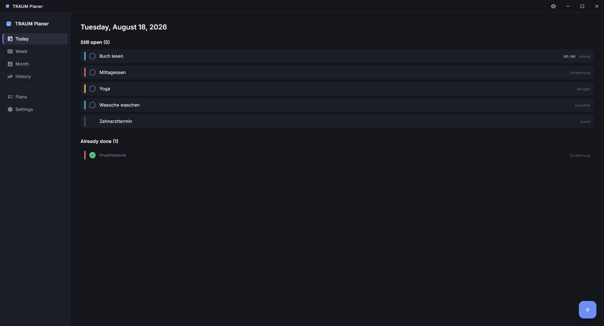
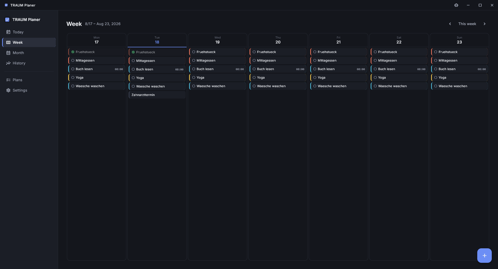
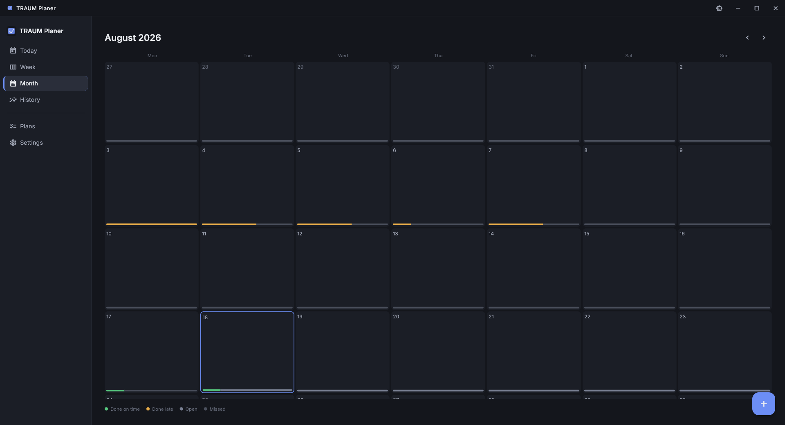
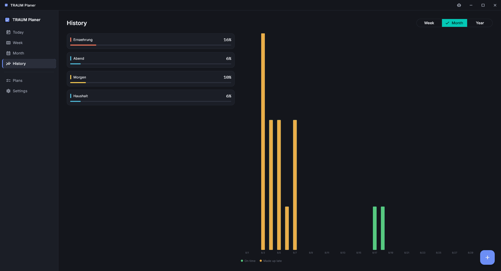
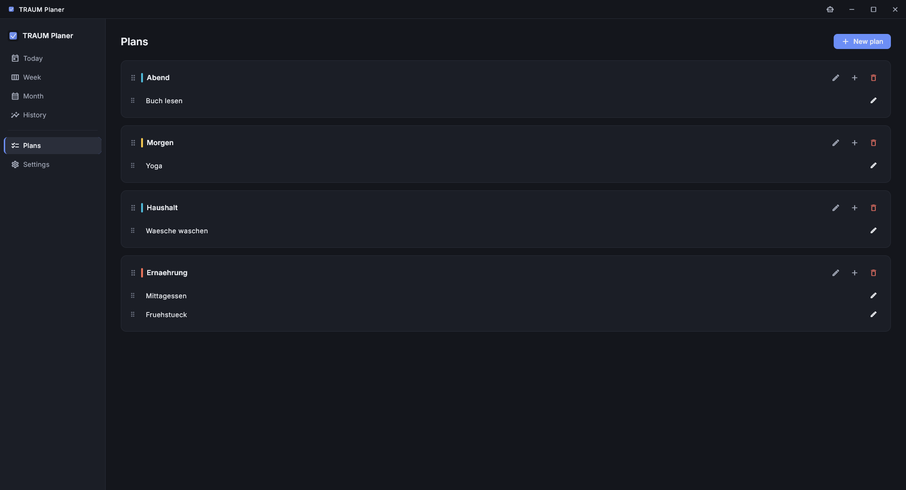
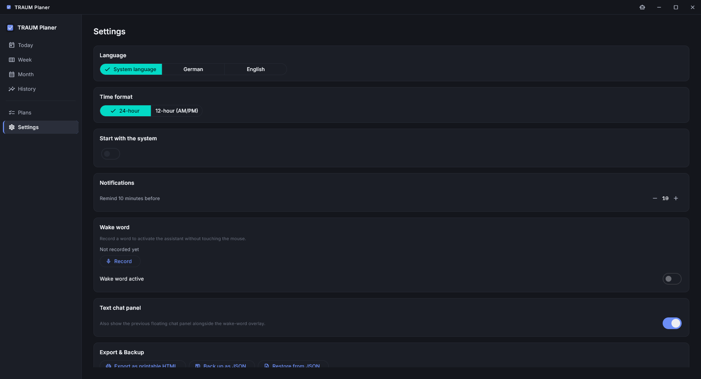
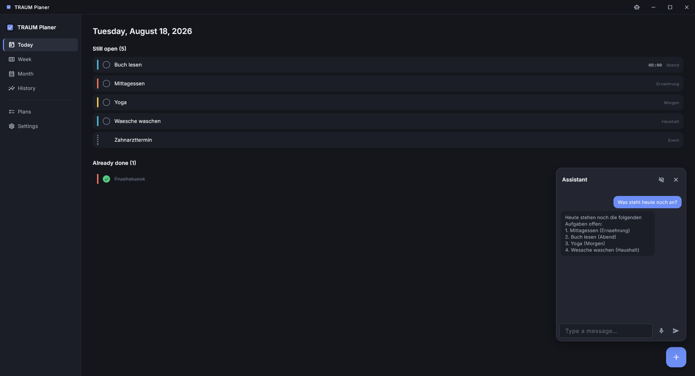

Ein Wochenplaner für den Desktop, der einfach läuft — ohne Konto, ohne Cloud, ohne Internet. Aufgaben, wiederkehrende Pläne, Termine und ein ehrlicher Verlauf, wer wie oft dranbleibt. Für Windows und Linux.



Alles, was du einträgst, bleibt auf deinem Rechner. Kein Tracking, kein Login, kein "bitte Internetverbindung prüfen" beim ersten Start.

## Woche und Monat auf einen Blick

Zwischen Tag, Woche und Monat wechseln, auch in die Vergangenheit zurückblättern und rückwirkend abhaken — nachgeholt zählt als "verspätet", nicht als Fehltag.




## Verlauf, der nicht anklagt

Erfolgsquote und Streak pro Plan, dazu ein Verlauf über Woche, Monat oder Jahr — pünktlich und verspätet farblich unterschieden, verpasste Tage bleiben schlicht grau statt rot.



## Eigene Pläne, per Drag & Drop sortiert

Beliebig viele Pläne mit eigener Farbe, Aufgaben mit täglicher, wöchentlicher oder monatlicher Wiederholung. Reihenfolge einfach per Drag & Drop anpassen.



## Zweisprachig bis ins Detail

Deutsch oder Englisch, 12- oder 24-Stunden-Format — beides unabhängig einstellbar. Dazu Autostart, Tray-Icon statt Beenden, Erinnerungen vor Fälligkeit und Export als druckbares HTML oder JSON-Backup.



## Ein Assistent, der wirklich lokal ist

Optional ein Sprachassistent, der komplett auf dem eigenen Rechner läuft (Ollama + lokales Spracherkennungsmodell) — fragt nach offenen Aufgaben, trägt neue ein, hakt rückwirkend ab, löscht Aufgaben und Termine wieder. Ohne ihn ist die App genauso voll nutzbar.



Wer lieber redet statt tippt: ein selbst eingesprochenes Aktivierungswort (dreimal in den Einstellungen aufnehmen) startet den Assistenten freihändig. Erkannt wird es über ein eigenes, leichtgewichtiges Muster-Matching — kein Dauer-Streaming an ein Spracherkennungsmodell im Hintergrund. Bei Treffer erscheint ein Vollbild-Overlay mit weichgezeichnetem Hintergrund: zeigt live den erkannten Text, dann die Antwort, während sie vorgelesen wird, und bleibt danach kurz offen für eine Anschlussfrage, ohne dass das Wort wiederholt werden muss.

## Loslegen

Fertige Builds aus dem [neuesten Release](https://github.com/Lupus-atque-Corvus/traum-planer/releases/latest) laden:

- **Windows:** Installer, keine Adminrechte nötig, ca. 500 MB (inklusive lokalem Spracherkennungsmodell).
- **Linux:** AppImage, keine Installation nötig — ausführbar machen (`chmod +x`) und starten.

---

## Tech-Stack

Flutter/Dart · Drift (SQLite) · Riverpod · GoRouter · `flutter_localizations` (ARB, de/en)

Vollständige Spezifikation: [`docs/spec.md`](docs/spec.md).

## Entwicklung

```sh
flutter pub get
flutter run -d windows   # oder: -d linux
```

Generierte Dateien (`lib/data/database.g.dart`, `lib/l10n/gen/`) sind eingecheckt, damit ein frischer Checkout sofort läuft. Nach Änderungen an `lib/data/tables.dart` oder den ARB-Dateien neu generieren:

```sh
dart run build_runner build --delete-conflicting-outputs
flutter gen-l10n
```

## Sprach-/LLM-Assistent (Phase 8, optional)

Der Assistent (Roboter-Icon in der Titelleiste) läuft komplett lokal und ist optional — ohne ihn ist die App voll nutzbar. Voraussetzungen, falls gewünscht:

- **LLM:** [Ollama](https://ollama.com) lokal installieren und einmalig `ollama pull qwen2.5:3b` ausführen (App spricht `http://localhost:11434`, siehe `lib/services/ollama_service.dart`). Läuft Ollama nicht, blendet das Panel automatisch einen entsprechenden Hinweis ein.
- **STT:** Whisper-Modell einmalig laden: `bash tool/fetch_models.sh` (lädt `assets/whisper/ggml-small.bin`, ~465 MB, wird als Flutter-Asset gebündelt). Die Spracherkennung (`whisper_ggml`, mehrsprachig, automatische Spracherkennung) lädt das Modell und erkennt die Sprache zuverlässig. **Bekannter Randfall:** Sehr kurze/nahezu leere Aufnahmen (unter ca. 1,2 Sekunden) lassen den nativen Dekodier-Schritt reproduzierbar abstürzen — vermutlich eine Randfall-Indexierung bei sehr wenigen Mel-Frames in `whisper.cpp` selbst (getestet über AVX2- und Baseline-SSE2-Build sowie zwei `whisper_ggml`-Versionen hinweg, tritt in beiden identisch auf). Die App wehrt das jetzt defensiv ab (`lib/services/stt_service.dart`: Aufnahmen unter 1,2 s werden verworfen, bevor `whisper.cpp` überhaupt aufgerufen wird) — mit normaler Sprachdauer (mehr als ein, zwei Worte) tritt der Absturz in Tests nicht mehr auf. Ohne AVX2 (CMake-Option `WHISPER_GGML_AVX2=OFF`) läuft die Dekodierung auf dieser Testhardware zudem spürbar langsamer.
- **TTS:** Windows nutzt die vorinstallierte SAPI (`System.Speech`, kein zusätzliches Setup). Linux benötigt `espeak-ng` (`apt install espeak-ng` o. ä.).
- **Aktivierungswort:** braucht kein zusätzliches Setup — Erkennung läuft über `lib/services/wakeword/` (Log-Mel-Merkmale + Dynamic-Time-Warping gegen 3 selbst aufgenommene Proben, `fftea` für die FFT). Standardmäßig deaktiviert, Proben werden in den Einstellungen aufgenommen.

## Windows-Installer bauen

```powershell
flutter build windows --release
& "$env:LOCALAPPDATA\Programs\Inno Setup 6\ISCC.exe" installer\traum-planer.iss
```

Ergebnis: `installer\output\traum-planer-setup-<version>.exe`. Installiert pro
Benutzerkonto (`%LOCALAPPDATA%\Programs\TRAUM Planer`, kein Adminrecht/UAC
nötig), legt Start-Menü- und Desktop-Verknüpfung an, bündelt die App inkl.
Whisper-Modell (~500 MB). Getestet: kompilieren → installieren → starten →
läuft.

Optionale zweite Komponente bündelt Ollama + `qwen2.5:3b` vollständig
offline mit (kein Download bei der Ersteinrichtung) — dafür müssen erst die
Vendor-Dateien lokal befüllt werden, siehe
[`installer/vendor/ollama/README.md`](installer/vendor/ollama/README.md).
Ohne diese Dateien überspringt der Installer die Komponente automatisch statt
mit einem Fehler abzubrechen.

## Linux-Build

Flutter-Desktop-Apps lassen sich nicht cross-kompilieren — der Linux-Build
läuft deshalb über eine GitHub-Actions-Pipeline
([`.github/workflows/linux-build.yml`](.github/workflows/linux-build.yml)),
die bei jedem `v*`-Tag automatisch ein AppImage baut und als Release-Anhang
bereitstellt. Lokal auf echtem Linux:

```sh
flutter pub get
bash tool/fetch_models.sh
flutter build linux --release
```

## Lizenz

Noch nicht festgelegt.
